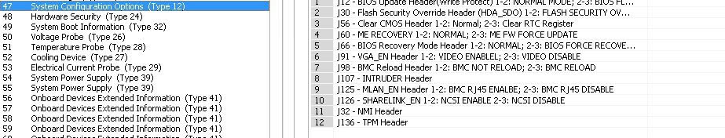

# Сервер Inspur SA5212M5 = NF5280M5
Модель для основного(китайского) рынка: NF5280M5, модель для интернет-клиентов: SA5212M5

- [Мануал на английском](2020040211224398612.pdf) 

>Сервер Inspur Yingxin NF5280M5 предназначен для удовлетворения потребностей Интернета, IDC (Интернет-центров обработки данных), облачных вычислений, корпоративных рынков и телекоммуникационных приложений. Это двухсокетный стоечный сервер высотой 2U на базе масштабируемых процессоров Intel® Xeon®. NF5280M5 отвечает большему количеству требований пользователей к высокой пропускной способности сети, высокой вычислительной производительности и большой емкости памяти. Кроме того, это оптимальное решение для клиентов с особыми требованиями к плотности размещения и объему памяти. Он отлично подходит для пользователей с высокими требованиями к серверам для больших данных, бизнес-аналитики, финансовых услуг, а также публичных и частных облачных приложений.

**Inspur NF5280M5 — 2U Rackmount Server**  
*Ключевые характеристики:*

*   **Процессоры:** 2 x Intel Xeon Scalable (до 28 ядер, TDP до 205 Вт)
*   **Память:** 24 x DDR4 DIMM (до 2933 МТ/с), до 3 ТБ (RDIMM/LRDIMM)(По опыту работает и с UDIMM), поддержка AEP
*   **Хранилища:**
    *   Frontplane: до 12 x 3.5" или 25 x 2.5" HDD/SSD
    *   Backplane(через riser): до 4 x 3.5" или 4 x 2.5" HDD/SSD
    *   M21: 2 x M.2 SSD
    *   Поддержка NVMe (до 24 x U.2)
*   **Расширение:**
    *   2 слота X24 разделение через riser с бурификацией на X16+X8 / X8+X8/X8, еще 1 слот X24 но с X16 линиями
    *   Поддержка до 4 x GPU
    *   OCP/PHY слот для сетевых карт (1G/10G/25G)
*   **Сеть:** Опциональные PHY, OCP или стандартные PCIe карты (1G/10G/25G/40G/100G)
*   **Блоки питания:** 2 x hotswapable PSU (550–2000 Вт, Platinum/Titanium), 1+1 резервирование
*   **Управление:** BMC (IPMI 2.0, KVM over IP, Redfish, виртуальные медиа)
*   **Охлаждение:** 4 x hotswapable вентилятора (N+1) 8056
*   **Габариты (2U):** 87 x 478.8 x 811.5 мм (с рельсами)

## Отличия версий BIOS и ссылки
Так просто их не найти, но поддержка ответила
1.  **Standard BIOS** [BIOS](https://github.com/Yjjx/Yjjx-helpfulness/blob/main/homelab/inspur_sa5212m5/NF5280M5_BIOS_4.1.30_Standard_20240123.zip) [BMC](https://github.com/Yjjx/Yjjx-helpfulness/blob/main/homelab/inspur_sa5212m5/NF5280M5_BMC_4.30.0_Standard_20240207.zip)
    *   Предназначен для стандартных сценариев использования с полной функциональной поддержкой.
    *   Включает последние обновления безопасности и функции.
    *   Совместим с различными конфигурациями оборудования и операционными системами.

2.  **4 GPU Balanced BIOS** [BIOS](https://github.com/Yjjx/Yjjx-helpfulness/blob/main/homelab/inspur_sa5212m5/NF5280M5-4GPUBalance_BIOS_4.1.3_Standard_20230505.zip) [BMC](https://github.com/Yjjx/Yjjx-helpfulness/blob/main/homelab/inspur_sa5212m5/NF5280M5_BMC_4.25.6_GPUBALANCE_20191025.zip)
    *   Оптимизирован для систем с четырьмя **GPU**, обеспечивая сбалансированную производительность и энергопотребление.
    *   Включает специальные настройки управления питанием и производительности для приложений, интенсивно использующих **GPU**.

3.  **Costdown BIOS** [BIOS](https://github.com/Yjjx/Yjjx-helpfulness/blob/main/homelab/inspur_sa5212m5/NF5280M5_BIOS_4.1.3_Costdown_20230104.zip) [BMC](https://github.com/Yjjx/Yjjx-helpfulness/blob/main/homelab/inspur_sa5212m5/NF5280M5_BMC_4.29.5_Costdown_20230704.zip)
    *   Применим только к определенным **материнским платам** с оптимизированной себестоимостью.
    *   Данная версия прошивки не может быть заменена на другие варианты **BIOS**.
    *   Предоставляет адаптированные **патчи безопасности** и функциональные корректировки для **чувствительных к затратам ** конфигураций.

**В итоге:**
*   **Standard BIOS** является универсальным и подходит для общего использования.
*   **4 GPU Balanced BIOS** предназначен для высокопроизводительных систем с **GPU**.
*   **Costdown BIOS** закреплен за определенными **материнскими платами** с оптимизированными функциями и ограничениями.
> **— Izzad**, Inspur Tech-Support Engineer
- Так как скачивание с сайта inspur часто невозможно если вы не китаец, часть драйверов, а так же остальные найденные версии BIOS можно скачать тут https://github.com/Yjjx/Yjjx-helpfulness/tree/main/homelab/inspur_sa5212m5 

## Джамперы, информация полученная из дампа bios

## Parts list
Так как inspur не предоставляет такой информации то вот parts list из того что удалось найти.

Материнские платы 
* YZMB-00882-101, YZMB-00882-100, YZMB-00882-10A

PCI-e riser
* YPCB-00776-1P2 - X16+X8 [Aliexpress](https://ali.click/q6plnq)
* YPCB-00772-1P2 - X16 (но не тот что вставляется в 3й слот)
* YPCB-00771-1P2 - X8+X8+X8 [Aliexpress](https://ali.click/q6plnq)
* К сожалению riser для установки в 3й PCIe слот не найден. 

M2 адаптер
* YZRI-00880-101 M2x2

SAS RAID/HBA 
* YPCB-00424 [Aliexpress](https://ali.click/sshmmw)

Сетевые карты OCP/Проприетарные

* YZNC-00763-101 [Aliexpress](https://ali.click/y5qln9)
* PCB001123 CX4421A 2*25GbE SFP28
* PCB001460 CX556A-ECAT 2x 100G Ethernet

Frontplane 
* YZBB-00789-101 12 LFF

Backplane 
* YZBB-00768-101 2 SFF   [Aliexpress](https://ali.click/nbqlnp)

FAN
* [Aliexpress](https://ali.click/jmixle)

1: Через слот M2_conn, требует переходника который практически не найти в продаже YZRI-00880-101
